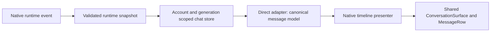
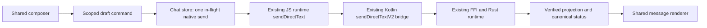

# Account client integration — 2026-10-05

This extends Design 10 without replacing the approved mobile visual language. Verification results and artifact hashes are recorded in the session evidence; source inspection alone is not authenticated E2E.

Final build/device limits and measurements are in the [Account 11 verification report](../reviews/mobile-account-11-verification-2026-10-05.md).

## Actual boundaries

`App.tsx` still owns the existing native bootstrap, identity/enrollment ceremony and runtime security gates. `AccountAppearanceProvider` owns only public, device-local presentation preferences. It does not own account identity, secrets or conversation plaintext.

`HomeScreen` and `DirectConversationScreen` use `AccountFrame`. The frame composes the same `ChatDeck`, `WallpaperSurface`, `ProfileEntry` and profile sheet frame as the isolated design client. `AccountDirectory` uses shared `DirectoryRow`/`DockItem`. `NativeDesignTimeline` supplies the existing native projection to `ConversationSurface`, `MessageRow`, the composer and message action sheet. No account path imports design fixtures, timers, transfer implementations or demo models.

## Capabilities and history

| Capability | Design adapter | Native text Direct |
|---|---|---|
| Text send/history/events | deterministic fixtures | existing authenticated runtime |
| Copy text | explicit write-only clipboard | explicit write-only presentation clipboard |
| Reply/edit/delete | demo commands | unavailable |
| Message attachments/retry | demo commands | unavailable |
| Delivered/read | unavailable | unavailable |
| Load older | fixture presentation | unavailable; current native projection is bounded to 100 |

`Sending`, `Sent`, `Failed`, `Unknown` come from the existing native projection. `Sent` is not a receipt or evidence of reading. Unknown is not converted into Sent and is not automatically retried. Copy does not mutate transport state. Future unsupported commands must be added at the capability/adapter boundary only when a real native contract exists.

The native list identifies the beginning of currently available history at its loaded boundary, without a pagination spinner or a promise of older history. Canonical stable UI IDs drive rendering and anchor restoration.

## Ownership and privacy

Draft and viewport scope is `origin + userId + directGeneration + conversationId`. In-flight send ownership uses the same scope. Completion from a previous scope cannot clear another draft or display an error in a newly selected conversation. Global native serialization can temporarily block composing in another chat; the UI now explains that operation.

Viewport callbacks also own a particular mounted visit. `useDirectViewportOwner`
rejects old measurements, viewability/scroll callbacks and index-failure events
after A -> B -> A, account/origin/generation changes or unmount. Restoration
reads the latest projection rather than an array captured by an earlier layout
callback. Stored anchors remain canonical stable message IDs.

Background/inactive and runtime/account revocation preserve the existing fail-closed policy: unsubscribe/invalidate the epoch, remove renderable plaintext and transient conversation state, and require the existing reopen gate. This deliberately clears sensitive drafts rather than introducing unapproved permanent storage. Device appearance survives account scope changes because it contains public presentation preferences only. OS wallpaper picking may trigger that existing privacy lock; the appearance owner survives the picker without retaining old account dialogs.

Preference hydration has a bounded deadline and safe fallback; late results from a replaced storage owner are rejected. Wallpaper images follow the existing bounded local picker/sanitization/storage design. They are not fetched from a server.

## Sheets, blur and motion

`VeilSheet` is the common panel frame. Its grip supports downward swipe, accessible activation/dismiss and Android Back. There are no close crosses in the migrated panels. Composer cancel, deletion cancel and search-clear controls remain semantic actions.

The root and nested sheet owners apply live `RenderEffect` blur on Android API 31+. The navigation underlay also uses this live view, with radius tied to deck progress. There is no screenshot capture, bitmap-copy backdrop or moving black scrim. A second native modal blurs the underlying sheet while the final sheet stays sharp.

This uses Android's documented [View RenderEffect mechanism](https://developer.android.com/develop/ui/views/layout/custom-views/custom-drawing). API 24–30 and iOS currently retain a clear underlay because this local implementation has no live blur backend there; no fake blur/dimming fallback is claimed. Wallpaper brightness is a separate explicit appearance preference.

| Transition | Shared implementation |
|---|---|
| Chat/dock navigation | `ChatDeck`, Reanimated spring, whole-screen translation |
| Profile/actions/picker/viewer/trust panels | `VeilSheet`, shared 220 ms transition/native driver |
| Reply/attachment layout | shared conversation/composer primitives |
| Quoted-message highlight | transient selection/highlight controller |
| Reduce Motion | local preference OR system setting; no sheet/deck motion when enabled |

## Error and startup presentation

`accountStartup` classifies existing native facts only: loading, locked, unavailable, recoverable error, fatal configuration error, ready. The only configuration code matched specially is the existing `VEIL-NODE-004`. This classifier is presentation, not authorization. Existing security gates remain authoritative.

`VeilState` supplies reusable public loading/empty/unavailable/capability/offline/error presentation. Bootstrap that takes unusually long exposes an existing manual retry; it does not silently turn into demo mode or add an automatic retry loop. Public failure cards retain the existing catalog, never display raw native exceptions, private paths, Passes or message text.

`useDirectHistoryWait` replaces a history-loading spinner after ten seconds with
an honest waiting notice and the existing manual verification action. This is
a presentation deadline, not a native error, cancellation, failed send or new
backend code. The composer stays blocked until an authoritative available
projection arrives. The deadline owns the exact scope/read revision, is reset
by explicit reload and is cleaned up on result, privacy clearing or unmount.

## Verification boundaries

Authenticated PC / phone Direct requires usable official test Access Passes, separate test identities and explicit existing trust establishment. A dedicated prior test-Pass file exists, but its remaining validity/use state and fresh test trust inputs have not been confirmed. No personal identity material was extracted. **E2E BLOCKED BY TEST CREDENTIALS**. A successful bundle, Kotlin compile, tester verifier or design fixture does not imply real Direct E2E.

The isolated design package allows fixture screenshots. The account tester retains its existing FLAG_SECURE/capture policy; account capture restrictions must not be bypassed for screenshots or profiling. Physical authenticated account history, send, reconnect and incoming switching remain blocked until the credential-dependent ceremony is completed.

The physical Samsung already contains an older account tester signed with certificate `a85ef3edcd837c3f71679ac50d02165fe4a60258e56b062057a278ba35fe792c`; the independent current tester certificate is `f5df868d3f517c0853225840e2c4f67f2d7b20d05b183bf1ab396e530fc3f250`. Android cannot update this installation across signing identities. Its data was neither read nor cleared. New-account physical startup/accessibility/E2E needs a clean test installation or an explicitly approved migration. Shared presentation checks use only the isolated fixture package.
