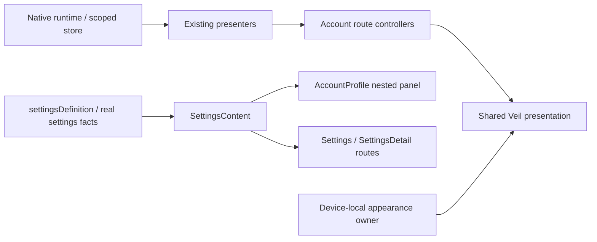

# Veil Mobile — Design 12

Status: presentation migration and host/build verification passed; physical and authenticated post-migration regression remain blocked. This is not a claim that every Definition of Done item has passed. Exact APK hashes, the frozen source snapshot and evidence categories are in the [verification report](../reviews/mobile-design12-verification-2026-10-05.md).

The owner confirmed real desktop → mobile and mobile → desktop text Direct on the preceding client. That is user-verified exchange, not merely source integration. A post-migration exchange must still be checked against the new APK. Rust, protocol, crypto, trust, Node, production signing and backend were not changed in this UI pass.

## Reachable route audit

| Route / entry | Classification after migration | Implementation / boundary |
|---|---|---|
| Home / Direct directory | SHARED VEIL | AccountFrame, AccountDirectory, ChatDeck, DirectoryRow, WallpaperSurface and floating profile |
| Direct | SHARED VEIL | Existing native presenter/store → NativeDesignTimeline → ConversationSurface; canonical statuses preserved |
| Contacts / New Direct | MIGRATED VEIL | ContactSearchScreen + AccountRouteSurface; useContactsPresenter remains authoritative |
| Own profile | SHARED VEIL | AccountProfile + ProfilePanelFrame; public account locator, no fake public profile editing |
| Settings root | MIGRATED VEIL | SettingsContent is used inside the profile and by the compatibility Settings route |
| SettingsDetail | MIGRATED VEIL | Same SettingsContent + settingsDefinition; full-screen route uses AccountRouteSurface |
| Appearance | SHARED VEIL | AccountAppearanceSettings; five themes, local background, dim, blur, Reduce Motion |
| About / diagnostics | MIGRATED VEIL | The `about` definition; version, build channel, diagnostics availability, project link, AGPL and complete Rocket.Chat MIT attribution |
| Account / recovery facts | MIGRATED VEIL | The `account` definition; it does not expose recovery words or invent native controls |
| Devices | MIGRATED VEIL | The `devices` definition; unsupported linking/revocation explicitly unavailable |
| Privacy / screen policy | MIGRATED VEIL | The `privacy` definition; release capture protection cannot be disabled by this UI |
| Notifications | MIGRATED VEIL | The `notifications` definition and existing Android settings action; no fake unread counters |
| Node / connection | MIGRATED VEIL | The `node` definition reads real runtime connection/sync/binding facts |
| Storage | MIGRATED VEIL | The `storage` definition; no new destructive cleanup or secret persistence |
| Bootstrap / runtime unavailable / public errors | MIGRATED VEIL | Context palette, VeilState and localized public-code presentation; no raw native diagnostic text |
| Identity welcome / setup launcher | MIGRATED VEIL | OnboardingScreen uses the same palette/radius; existing protected continuation logic retained |
| Peer identity / safety number / QR | MIGRATED VEIL presentation + security-owned ceremony | IdentityIslandSheet uses shared VeilSheet and palette; exact native origin/account/fingerprint/generation checks remain unchanged |
| RecoveryActivity / recovery input / native unlock / enrollment confirmation | NATIVE SECURITY CEREMONY | Existing native boundary retained; no visual rewrite of protected secret-handling screens |
| Legacy channel/member/server UI and old DesignPreviewScreens | NOT USER REACHABLE in account shell | Not registered in the authenticated route graph; production bundle excludes the legacy preview routes |
| Standalone Settings compatibility entry | MIGRATED VEIL, currently no ordinary profile link to this separate route | Retained so navigation does not lose functionality; it renders the same content rather than a second settings system |

The original reachable legacy dependencies were ContactSearchScreen's Rocket ContactItem/theme, SettingsScreen's independent theme/definitions/rows, static security/error palettes, and the identity sheet's static palette. The latter keeps its native security semantics. Legal attribution remains even though the ordinary routes no longer import Rocket presentation.

## Ownership and navigation

Authenticated route types live in `src/presentation/account/routes.ts`; settings definitions and rendering are separate. No account screen imports design fixtures or demo transport. `RouteSurface` and `useVeilStyles` are presentation-only shared primitives, not a second UI kit.

Profile settings maintain a section stack: Settings → Appearance → About → Back returns to Appearance; another Back returns to Settings. Both the visible nested Back button and Modal/system Back use the same stack operation. Appearance's account/security and About callbacks select different real definitions.

Contact lookup pushes Direct over Contacts instead of replacing the search route. The query and result remain in the mounted Contacts owner. After a successful create, the presenter leaves `creating`; reopening the validated same result under the same binding/generation selects the known conversation rather than issuing a second create. Stale search/create responses retain the existing rejection checks. An offscreen Direct route does not pop Contacts when another native conversation is selected; focus restoration reselects only an existing directory conversation. Unknown selection fails closed.

A presentation-only navigation latch rejects repeated result presses during a Direct transition. The existing navigation focus event releases it when Contacts is revisited; its listener unsubscribes on unmount. Offscreen Contacts cannot start a create via a stale result press. Native lookup, create and verified-peer authority remain unchanged. Tests separately reject late create results after generation changes and snapshots with another origin, account or peer.

A failed projection read after native create does not prove that the account was unchanged. The error copy now states that the result is unconfirmed. Its manual retry repeats lookup, without automatically repeating create or exposing the underlying exception. This does not invent a send status or change native operation semantics.

Closing the directory search clears its query, in both account and demo directories. A hidden field can no longer keep an invisible filter active.

## Sheet and profile semantics

`useSheetMotion` owns presentation lifetime and native animation. Grip, accessible dismiss, outside tap, swipe, system Back and ordinary `visible=false` closure share the exit. Ordinary prop closure retains the Modal/blur until completion. A reopened owner rejects an older completion. Reversed upward drag cancels dismissal. Reduce Motion cancels short/reversed/terminated gestures immediately without a decorative spring. Unmount invalidates callbacks. Existing privacy/account teardown still removes the owner immediately.

Identity's visible Back uses the same sheet controller; the QR scanner remains a nested security-owned panel. Back closes the scanner before its parent identity. Native verification requests and results were not modified.

Demo profile editing now has a separate draft. Save applies both fields once; Cancel and leaving edit restore the previous profile. The surface explicitly says it is a demo profile. This does not imply a server/public profile update API.

External panel closure also discards an unfinished edit before reopening. It does not publish or persist the draft.

## Verification requirements

Meaningful tests cover contact query/result restoration, duplicate-create avoidance, stale authority, hidden search filtering, distinct About/security destinations, nested/system Back, focus restoration and listener cleanup, draft Save/Cancel, sheet dismiss parity, interrupted/reversed gestures and Reduce Motion. Boundary checks reject reachable legacy presentation and demo implementations; production export still requires the complete shipped MIT notice.

The read-only account readiness script reports that it does not run authenticated E2E or assess credential availability/prior exchanges. It no longer declares a missing-credential blocker without evidence. Separate CLI tests verify this limitation and redaction of signing-input values. Its file-presence checks do not replace the APK verifier or physical exchange.

Physical evidence must state the package, version, source snapshot and signer. Screenshot/content baselines exclude reliance on the system status bar. Contact Search empty/result/error and account unavailable have component-level deterministic scenarios; they are not Android screenshot goldens until captured on the migrated account APK.

The connected SM-S911B (Android 16) has an older account APK signed with SHA-256 `a85ef3edcd837c3f71679ac50d02165fe4a60258e56b062057a278ba35fe792c`. The maintained tester key is `f5df868d3f517c0853225840e2c4f67f2d7b20d05b183bf1ab396e530fc3f250`. In-place account update is incompatible. Existing account data was neither read from app storage nor cleared. This blocks installing the new account APK on this device while preserving its account; it does not block the independently installed design preview.

URL interaction, search in the available native history and Design 13 Spaces remain next steps after Design 12's account/device gates pass. Existing attachments and spaces in design preview remain explicit demo. No pagination, Delivered/Read, account unread, production attachments or group permissions were invented.
