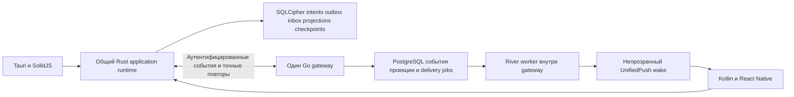

# Дорожная карта надёжности бэкенда и мобильного клиента Veil

Дата исследования: 4 октября 2026 года. База кода: `e9f020c5332b892feeec20313c239795e0587bd4`.
Статус: предложение по реализации. Задачи и новые контракты ниже ещё не выполнены и не приняты как ADR.

Цель — получить рабочий графический Android-клиент и общий устойчивый механизм отправки, получения и восстановления сообщений на ПК и Android, затем завершить мультиустройственность и групповой MLS. Сохраняем Go, PostgreSQL, Rust, SQLCipher, Tauri и React Native. Работа включает как клиентский интерфейс, так и жизненный цикл сообщения и согласованность платформ.

Уточнение исходного состояния: полноценного графического клиента на телефоне сейчас нет. Отдельные экраны, дизайн-превью и native API не означают готовый пользовательский сценарий. Сначала выбрать готовую frontend основу в M00, затем реализовать и собрать рабочий Direct GUI в M01–M04; лишь после этого возможна проверка ПК ↔ Android через приложение. Развитие интерфейса до согласованного release scope входит в M05.

Карта дополняет [INTEGRATION_ROADMAP](../../INTEGRATION_ROADMAP.md), [архитектуру](../architecture.md) и [ADR 0004](../adr/0004-clean-slate-v0.3-and-open-source-crypto.md). Она не меняет принятые криптографические решения автоматически. OpenMLS остаётся выбранным направлением для групп; Direct v2 остаётся действующим протоколом. Возможный выбор libsignal потребует отдельного ADR с явным пересмотром соответствующего положения ADR 0004.

## Основания и ограничения исследования

Проверены runtime пути сервера, миграции, общая клиентская библиотека и адаптеры desktop и Android. В предыдущем обзоре обычные Go tests дали 868 успешных результатов тестов и подтестов, `go vet ./...` прошёл. Это не 868 независимых сквозных сценариев. Покрытие обычного запуска составило 28,5 процента statements; интеграционные тесты в этот показатель не входят. Gateway с integration tag успешно компилировался при запуске без тестов.

PostgreSQL и Docker daemon для воспроизведения DB сценариев были недоступны. Rust test build остановился на отсутствии MSVC `link.exe`, до выполнения assertions. Независимый криптографический аудит этим исследованием не выполнен. Интернет и upstream исходники проверялись на дату документа; перед добавлением зависимости выбираются конкретные release и commit.

| Наблюдение | Основание в текущем коде | Статус |
|---|---|---|
| Desktop text send обходит durable outbox | [desktop lib.rs](../../veil-desktop/src-tauri/src/lib.rs), строки 7854–7877; [client api.rs](../../veil-client/src/api.rs), 5838–5862 и 5996–6024 | Подтверждено чтением runtime пути |
| Android outbox атомарный, но принятие текста требует соединения | [api.rs](../../veil-client/src/api.rs), 6033–6060 и 6197–6217 | Подтверждено; полноценный offline compose ещё отдельная задача |
| Mobile history отвергает attachment, edit, delete и TTL | [direct_history.rs](../../veil-client/src/direct_history.rs), 556–570; [FFI](../../veil-ffi/src/lib.rs), 2451–2457 | Намеренная защита незавершённого контракта |
| Графический Android-клиент не готов; authenticated Home ведёт в design preview | [ChatListScreen](../../veil-mobile/src/screens/ChatListScreen.tsx), 83–89; [HomeScreen](../../veil-mobile/src/screens/HomeScreen.tsx); [DirectConversationScreen](../../veil-mobile/src/screens/DirectConversationScreen.tsx) | Есть переиспользуемые части, но готовность полноценного GUI не доказана |
| Direct выбирает одно peer device | [auth handler](../../veil-server/internal/auth/handler.go), 541–545; [gateway hub](../../veil-server/internal/gateway/hub.go), 1141 | Документированное ограничение продукта |
| После commit fanout может не состояться | [chat.go](../../veil-server/internal/chat/chat.go), 310–351; [push dispatcher](../../veil-server/internal/push/dispatcher.go), 125–163 | Подтверждённая граница доставки |
| DeleteChannel конфликтует с FK сообщений | [servers.go](../../veil-server/internal/db/servers.go), 730–750; [migration 001](../../veil-server/migrations/001_initial.sql), 43 | Статический дефект; DB reproducer нужен первым |
| ReorderChannels может частично сохраниться | [service.go](../../veil-server/internal/servers/service.go), 420–448 | Статический дефект; DB reproducer нужен первым |
| Курсор по времени может пропустить поздний commit | [queries.go](../../veil-server/internal/db/queries.go), 1072, 1132, 1202 и 1711 | Выведено из порядка операций; нужен конкурентный reproducer |
| Crossed Direct initiation может оставить разные sticky sessions | [api.rs](../../veil-client/src/api.rs), 8098 и 8168–8176; [direct.rs](../../veil-client/src/direct.rs), 589–590 | Гипотеза до парного исполняемого теста |
| Gateway integration suites не включены в CI команду | [go.yml](../../.github/workflows/go.yml), 253; [sender_key_integration_test.go](../../veil-server/internal/gateway/sender_key_integration_test.go) | Подтверждено; восемь top level тестов |

Старые утверждения roadmap о несовпадении contact routes, заголовка подписи и обязательной дружбе для create DM не использовать: текущие server routes и mobile signatures совпадают, create DM такого prerequisite не имеет.

## Решения из открытых проектов

| Решение | Что подходит Veil | Способ использования |
|---|---|---|
| [River](https://github.com/riverqueue/river) | PostgreSQL jobs и вставка через существующую pgx transaction | Предпочтительный кандидат для серверной delivery queue после R11 |
| [Watermill SQL](https://github.com/ThreeDotsLabs/watermill-sql) | SQL outbox и pub sub, опыт безопасных offsets | Альтернатива для будущего event bus; сейчас архитектурный референс |
| [Matrix Rust SDK](https://github.com/matrix-org/matrix-rust-sdk) | Общий native engine, send queue, local echo, зависимости media и send | Заимствовать организацию; SDK не подключать к собственному протоколу Veil |
| [AndroidX WorkManager](https://developer.android.com/develop/background-work/background-tasks/persistent/getting-started) | Persistent bounded work, unique work, cancellation | Добавить native scheduler для wake; crypto authority определять отдельно |
| [Now in Android](https://github.com/android/nowinandroid) | Разделение worker, scheduler и data layer | Использовать пример конечного worker, не переносить Hilt и Room в Veil |
| [UnifiedPush connector](https://github.com/UnifiedPush/android-connector) | Регистрация distributor и lifecycle push endpoint | Завершить существующую интеграцию с native account binding |
| [ntfy Android](https://github.com/binwiederhier/ntfy-android) | Разделение постоянного distributor соединения и catch up | Референс bounded polling и deduplication |
| [OpenMLS](https://github.com/openmls/openmls) | Уже выбранная реализация группового MLS | Продолжить `veil-mls` и существующий SQLCipher adapter |
| [libsignal](https://github.com/signalapp/libsignal) и [Sesame](https://signal.org/docs/specifications/sesame/) | Готовая session machinery и требования multi device | Ограниченное исследование Direct adapter до решения о зависимости |

River имеет core под [MPL 2.0](https://github.com/riverqueue/river/blob/master/LICENSE), Watermill SQL — [MIT](https://github.com/ThreeDotsLabs/watermill-sql/blob/master/LICENSE), Matrix SDK — [Apache 2.0](https://github.com/matrix-org/matrix-rust-sdk/blob/main/LICENSE), OpenMLS — [MIT](https://github.com/openmls/openmls/blob/main/LICENSE), libsignal декларирует [AGPLv3](https://github.com/signalapp/libsignal#license). Это сведения upstream, не заключение о всей будущей сборке. В PR добавления зависимости обновлять lockfiles, allow lists, notices и проверять принятый в Veil процесс лицензирования. Прямое копирование исходников требует сохранения их notices.

## Целевая архитектура

Rust владеет message lifecycle, crypto transitions, sync и retry решениями. Платформы предоставляют transport, keystore, lifecycle и UI projections. PostgreSQL является источником принятого ciphertext и delivery intent. Push и WS ускоряют получение; восстановление обеспечивают durable events и checkpoints.

Один gateway остаётся поддерживаемой топологией первого этапа. Несколько River workers не связывают локальные WS hubs. Межпроцессный fanout вводится после измерения потребности и отдельного решения.

## Последовательность этапов

Размеры относительные: малый — локальная правка, средний — несколько согласованных компонентов, большой — новый контракт или протокол. Они помогают выбирать размер PR, но не обещают календарных сроков.

| Этап | Задачи | Зависимость | Проверяемый результат | Размер |
|---|---|---|---|---|
| 0 Воспроизводимость | R01 | Текущий commit | Реальные regression scenarios и полный запуск нужных suites | Малый |
| 1 Серверные исправления | R02 R03 | R01 | Атомарные операции и ограниченные по времени запросы | Средний |
| 2 Общая отправка | R04 R05 R06 | R01 | Одинаковое восстановление отправки на ПК и Android | Большой |
| 2A Графический Android-клиент | M00 M01 M02 M03 M04 M05 | M00 сначала; M01 параллельно R01; M02 после R13; M03 вместе с R04; M04 после M01–M03 и R24a; M05 по мере завершения контрактов | Готовая frontend основа, затем рабочий Direct GUI до пользовательской проверки связи и интерфейс полного release scope | Большой |
| 3 История и sync | R07 R08 R09 R10 | R02 R04 | Incremental catch up без потери crypto steps | Большой |
| 4 Серверная доставка | R11 R12 | R02; полная версия после R08 | Message commit включает durable delivery intent | Средний |
| 5 Android | R13 R14 R15 | R13 после R01; R14a перед R12 device checks; R14b после R12; R15 после R09 R10 | Contacts и фон работают с явной native authority | Большой |
| 6 Несколько устройств | R16 R17 R18 R19 | R04 R07; реализация после R09 R10 | Один аккаунт на ПК и телефоне | Большой |
| 7 Групповой MLS | R20 R21 R22 | R07 R09 R10; фоновое поведение после R14 | Завершение принятого OpenMLS перехода | Большой |
| 8 Измерения и выпуск | R23 R24 | R24a готовится с самого начала; R24b проверяет каждый этап; итоговая матрица после своих этапов | Воспроизводимый tester и эксплуатационные evidence | Средний |

Ранние checkpoints: сначала завершить рабочий графический Direct-клиент M01–M04 и подготовить tester R24a. Лишь затем проводить первый пользовательский ПК ↔ Android тест, опираясь на R01, R04 и R13. Два разных аккаунта, по одному устройству, новая Direct беседа, неизменяемый текст без TTL и оба направления отправки. Наличие APK или успешный native test само по себе не закрывает готовность GUI. Тест не ждёт River, push и нового event feed, но обязательно ждёт исполняемый пользовательский сценарий. Это ещё не доказательство offline восстановления или поддержки всей накопленной истории.

После R07–R14 и соответствующих UI частей M05 проверяется полная история Direct между разными аккаунтами на ПК и Android с generic wake. Один аккаунт на двух устройствах требует R16–R19 и device UI из M05. Group parity требует R20–R22 и рабочих групповых экранов M05. Не объединять эти три продуктовых обещания в один статус «mobile готов».

## Где сосредоточены изменения

| Задачи | Основные точки входа в нашем репозитории |
|---|---|
| R01, R24 | [Go CI](../../.github/workflows/go.yml), [Rust CI](../../.github/workflows/rust.yml), [mobile tester CI](../../.github/workflows/mobile-tester.yml), существующие планы физических тестов ниже |
| M01–M05 | [App](../../veil-mobile/App.tsx), [навигация](../../veil-mobile/src/screens/ChatListScreen.tsx), [Home](../../veil-mobile/src/screens/HomeScreen.tsx), [Direct](../../veil-mobile/src/screens/DirectConversationScreen.tsx), [список бесед](../../veil-mobile/src/components/layout/ChannelsIsland.tsx), [переписка и ввод](../../veil-mobile/src/components/layout/ChatIsland.tsx), [chat store](../../veil-mobile/src/stores/chat.ts), [runtime lifecycle](../../veil-mobile/src/hooks/useVeilRuntimeLifecycle.ts) |
| R02, R03 | [DB servers](../../veil-server/internal/db/servers.go), [servers service](../../veil-server/internal/servers/service.go), [Hub](../../veil-server/internal/gateway/hub.go), [gateway main](../../veil-server/cmd/gateway/main.go), [migration runner](../../scripts/apply-migrations.sh) |
| R04–R10, R17–R19 | [client api](../../veil-client/src/api.rs), [Direct](../../veil-client/src/direct.rs), [history](../../veil-client/src/direct_history.rs), [SQLCipher DB](../../veil-store/src/db.rs), [FFI](../../veil-ffi/src/lib.rs), [desktop adapter](../../veil-desktop/src-tauri/src/lib.rs) |
| R07, R08, R11, R12 | [message queries](../../veil-server/internal/db/queries.go), [chat service](../../veil-server/internal/chat/chat.go), [push dispatcher](../../veil-server/internal/push/dispatcher.go), новые миграции рядом с существующими |
| R13 | [InlineContactSearch](../../veil-mobile/src/components/search/InlineContactSearch.tsx), [ContactSearchScreen](../../veil-mobile/src/screens/ContactSearchScreen.tsx), [native runtime](../../veil-mobile/android/app/src/main/java/io/veil/mobile/runtime/VeilMobileRuntime.kt), [native HTTP transport](../../veil-mobile/android/app/src/main/java/io/veil/mobile/runtime/NativeDirectHttpTransport.kt) |
| R14, R15 | [push service](../../veil-mobile/android/app/src/main/java/io/veil/mobile/push/VeilPushService.kt), [application lifecycle](../../veil-mobile/android/app/src/main/java/io/veil/mobile/MainApplication.kt), native runtime, [identity vault](../../veil-mobile/android/app/src/main/java/io/veil/mobile/crypto/NativeIdentityVault.kt), новый bounded worker |
| R20–R22 | [veil-mls](../../veil-mls/src/lib.rs), [MLS SQLCipher adapter](../../veil-mls/src/veil_db_store.rs), [keychain](../../veil-store/src/keychain.rs), [server MLS handler](../../veil-server/internal/mls/handler.go), native Android anchor adapter |

Названия новых таблиц и компонентов ниже — предлагаемый дизайн. Существующие имена функций и файлов служат точками входа; перед PR нужно проверить всех их вызывающих и обновить общий контракт, включая protobuf/UniFFI, если он затронут.

## Этап 0 Воспроизводимость и регрессии

### R01 Включить пропущенные проверки и зафиксировать сценарии

Изменить integration command на явный запуск `./internal/integration/... ./internal/db ./internal/gateway`, либо на все `./internal/...` после измерения времени. Для suite с PostgreSQL добавить race detector там, где это возможно, и timeout с запасом по измеренному времени. Проверка перечня integration packages должна ловить новый пакет, который забыли включить.

Добавить сценарии до исправления: удаление непустого канала, batch reorder с ошибкой второго item, send с потерянным ACK и reopen, поздний commit между страницами, два одновременных initiator. Последний сначала определяет, существует ли предполагаемый дефект; непрошедшая гипотеза не превращается в новую protocol feature.

Конкурентный DB тест использует управляемые барьеры: A начинает раньше и задерживается до conversation lock, B и D успевают commit, page с limit 1 возвращает cursor B, затем commit A. Проверять отсутствие A в старом проходе и правильность нового контракта.

Выход: каждый подтверждённый defect имеет failing regression на старом коде; зафиксированы команды, commit, ОС и результаты. Rust linker и локальная PostgreSQL среда исправляются как development prerequisites; это не часть product runtime.

## Этап 1 Атомарность сервера и обработка остановки

### R02 Определить удаление каналов и атомарно переставлять batch

Для `DeleteChannel` сначала выбрать контракт хранения. Рекомендация — явное архивирование с отдельным purge, если продукт должен сохранять авторизованную историю; если требование остаётся hard delete, удалить зависимые message, attachment, reaction и prototype MLS строки в одной транзакции. Не добавлять CASCADE ко всем таблицам автоматически. `message_send_idempotency` специально переживает удаление сообщения и сохраняет принятую судьбу точного повтора.

Для reorder: проверить весь batch, принадлежность, права и категории; в той же транзакции повторно подтвердить необходимые invariants и записать все изменения. Lock order детерминированный. Broadcast только после commit. Новые constraints вводить новой миграцией, не исправлением применённой migration 001.

Выход: удаление канала с сообщениями, attachments и мягко удалёнными строками следует выбранному контракту; ошибка любого reorder item оставляет все позиции прежними; повтор отправки после purge возвращает прежний outcome.

### R03 Ввести deadlines и закрывать весь runtime при shutdown

У `Client` и Hub появляются отменяемые lifecycle contexts. Обычные WS команды получают `context.WithTimeout(connectionContext, budget)` вместо текущего `context.Background()`. Budgets задаются для классов операций и валидируются при startup. Отмена соединения не отменяет уже совершённый commit: клиент разрешает неопределённый outcome тем же idempotency ID.

Остановка: прекратить admission, дать текущим командам ограниченное время, остановить worker, уведомить и закрыть WS, дождаться pumps, затем закрыть pool. HTTP shutdown самостоятельно WS не ждёт; это обязанность приложения согласно [Go Server Shutdown](https://pkg.go.dev/net/http#Server.Shutdown).

Hub продолжает принимать deregistration до завершения pumps либо unregister становится cancellation-aware: нынешний readPump отправляет в unbuffered канал, поэтому ранняя остановка `Hub.Run` может повесить shutdown. Janitors и остальные фоновые задачи также завершаются до закрытия pool.

Отделить короткий budget подключения БД от полного startup audit. Сейчас `cmd/gateway/main.go` использует общий десятисекундный context для соединения и проверок растущего хранилища. Полный аудит сохранить, но дать отдельный измеренный budget и безопасный progress без идентификаторов. Readiness остаётся закрытой до завершения проверок.

Выход: SQL lock wait прерывается, pool не удерживается бесконечно, shutdown укладывается в configured deadline, committed send не повторяется с новым ID. Для migration runner добавить coordination одного migrator и проверку drift применённых файлов; metadata обновлять совместимой миграцией ledger.

## Этап 2 Общая отправка и offline очередь

### R04 Подключить оба клиента к существующему atomic outbox

Начать с Direct text, используя `enqueue_direct_text_v1`, `enqueue_direct_message_outbox_v1` и существующий CAS. Desktop `send_message` перестаёт вызывать неустойчивый путь. Создать типизированный native результат с local ID и состоянием принятия; адаптировать desktop seq based reconciliation и публичные ошибки, а не подменять return value одним новым вызовом.

Общая транзакция: подготовленный ratchet candidate, exact SendMessage payload, digest, client ID, local message и author snapshot. В память состояние публикуется после commit; transport отправляет только committed bytes. Retry не шифрует заново, не меняет UUID, target device, origin или profile.

Разделить состояния «принято локально», «ждёт соединения», «принято Node», «подтверждено устройством» и «исход неизвестен». Node ACK не означает прочтения или фактического получения другим устройством.

Референс — [Matrix send queue](https://matrix-org.github.io/matrix-rust-sdk/matrix_sdk/send_queue/index.html): восстановление persisted requests, порядок внутри разговора, local echo и остановка на невосстановимой ошибке. Используем организацию, не Matrix wire/storage модель.

Выход: до durable commit наружу не выходит ciphertext и ratchet не меняется; после commit restart и потерянный ACK повторяют прежние ID и точные bytes, создавая один logical message. Stale ACK не завершает чужой pending item. Оба клиента проходят одни fixtures.

### R05 Принять offline intent без фиктивной network authority

Текущая atomic API требует `is_connected()`, поэтому она ещё не полноценная offline очередь. Разделить durable user intent и prepared immutable envelope. Пока нет проверенной сессии или свежего device binding, intent хранится внутри SQLCipher и ждёт подготовки.

Ввести локальную capability unlocked account с exact origin и account/device scope, отдельно от поколения сетевого соединения. Закрытый vault не принимает crypto операции. Known established session можно использовать только по определённой политике; stale directory не разрешает новый target. После reconnect intent проходит свежую проверку прав и device binding.

Изменение чернового intent допустимо до подготовки. После ратчетного commit нельзя просто выбросить envelope и забыть его шаг; правила cancel и зависимых edit определить в R07. При storage uncertainty очередь останавливается и authority отзывается.

Выход: airplane mode → ввод → process death → unlock → reconnect доставляет ровно один message; account/origin switch не переносит intent; revoke peer device до подготовки блокирует старый маршрут.

### R06 Добавить reply и зависимости encrypted upload

Расширить typed intent reply и attachment descriptors. Подготовка media, resume tus upload, подтверждение upload и подготовка message — сохраняемые состояния. Message ждёт upload; ключ и descriptors остаются в SQLCipher/E2EE payload. Сохраняются текущие chunked AEAD проверки.

Взять механизм зависимостей как идею из [исходников Matrix send queue](https://github.com/matrix-org/matrix-rust-sdk/blob/main/crates/matrix-sdk/src/send_queue/mod.rs), адаптировать его к уже существующему `veil-uploads`. Не переносить их plaintext media cache и собственную SQLite authority.

Выход: restart upload и send, duplicate finalize, tampered chunk, отмена, удаление исходного файла и ошибка после upload не создают сообщение с неверными descriptors. Старый product send path удаляется после перевода всех потребителей, включая attachments.

## Этап 2A Рабочий графический Android-клиент

Сначала выбрать готовую frontend основу в M00. M01–M04 — обязательный первый пользовательский срез, а M05 — дальнейшее развитие полноценного клиента. Эти задачи выполняются рядом с R04/R13; они не ждут завершения всего бэкенд-roadmap. Готовые экраны и компоненты соединить с существующими Veil onboarding, native мостом и lifecycle.

### M00 Выбрать готовую frontend основу до разработки экранов

Кандидаты и проверенные source seams собраны в [отдельном исследовании](../reviews/mobile-frontend-candidates-2026-10-04.md). После уточнения предпочтения пользователя первым проверить настоящий frontend Rocket.Chat: список бесед, поиск собеседника и текстовую переписку внутри существующего Veil App. [План адаптации](../reviews/rocket-chat-frontend-adaptation-2026-10-04.md) фиксирует конкретные компоненты, native contracts и оценку сложности. Готовность внешнего продукта не означает независимость от его SDK и БД.

Провести ограниченный build/adaptation spike Rocket.Chat 4.77.0: выбранные renderer и список/контакты, текущие native DTO, Android keyboard/insets и dependency diff. Проверить async native acceptance в composer и стабильный UI ID при ACK. Измерить фактическую работу и оставшийся объём оболочки. Сохраняются Veil identity, crypto, SQLCipher, outbox и native authority. Выбор не требует копировать чужой networking/storage pipeline.

Выход: одна выбранная frontend основа, pinned исходники/версия, notices, доказанная граница UI adapter и список оставшихся M01–M04 работ. Shortlist уже исследован; сборки кандидатов и их интеграция пока не выполнены.

### M01 Собрать реальный вход и навигацию приложения

Использовать выбранные в M00 готовые presentation элементы вместе с `App`, onboarding, `SecureRuntimeGate`, Home и settings Veil. Довести маршрут «запуск → создание/восстановление identity → unlock → подключение к Node → список Direct». Для существующего пользователя должен работать повторный запуск. Состояния загрузки, отсутствия identity, блокировки, отсутствия сети и ошибки доступны из интерфейса без внешних скриптов.

`ChatListScreen` сейчас выбирает `DesignPreviewHomeScreen as any`. После успешного M00 подключить production Home с выбранными Rocket presentation компонентами; существующие onboarding/runtime gates сохранить. Демо Circle/Space/Room оставить в отдельном preview входе. Определить типизированные маршруты Home, Contacts, Direct и Settings и убрать обходы типов на этом пользовательском пути: [официальная схема React Navigation](https://reactnavigation.org/docs/typescript/).

Выход: из штатного запуска можно дойти до реального Direct Home; все кнопки ведут в реализованный экран или показывают явную недоступность. Возврат, повторный unlock и смена account/origin не открывают экран прежней сессии. Это готовность входа и навигации, ещё не доказательство обмена сообщениями.

### M02 Соединить контакты, создание беседы и настоящий список

На production Home обеспечить достижимую кнопку поиска контакта. Использовать один UI для native операции R13; выбрать экран или встроенную панель, исключив два расходящихся сценария. Показывать поиск, отсутствие результата, проверенный результат, создание беседы и понятную ошибку.

После create Direct дождаться обновлённого native directory, появления conversation и корректного выбора в `useChatStore`, затем открыть Direct. Сейчас Direct screen требует одновременно существующий conversation и `selectedDmId`; один `navigate` с полученным UUID недостаточен. Список строить из реальных native projections; предусмотреть пустой список и повторное обновление без подставных контактов.

Выход: пользователь с пустым Home находит другого пользователя по username, создаёт или открывает существующую беседу и возвращается в обновлённый список. Для этого не нужны ручной UUID, deep link или изменение базы.

### M03 Довести графическую переписку до рабочего text сценария

Подключить выбранный готовый UI разговора через adapter к `DirectConversationScreen`, `useChatStore` и `VeilRuntime.sendDirectText`; существующий `ChatIsland` служит текущим примером привязки. Реализовать полный UI цикл: открыть историю, ввести текст, отправить через native outbox, увидеть подтверждённую локальную строку, получить новое входящее событие и обновлённый статус. Триггер обновления — native content revision и проекция, а не локальное добавление выдуманного сообщения.

Согласовать видимые статусы с R04: локально принято, ожидает соединения, принято Node, исход неизвестен, ошибка. Не представлять Node ACK как прочтение. Сбой сохраняет допустимый черновик в выбранном scope; durable offline compose включается только после R05. Loading, пустая история, unavailable и восстановление доступны пользователю.

Довести клавиатуру, safe areas, прокрутку, длинный текст и кнопку отправки на небольшом экране. Для растущей истории проверить замену общего `ScrollView` на виртуализированный список; ориентиры — [FlatList](https://reactnative.dev/docs/flatlist) и [KeyboardAvoidingView](https://reactnative.dev/docs/keyboardavoidingview), с проверкой поведения нашего Android window configuration. Сохранить очистку plaintext при отзыве runtime authority.

Выход: все операции text сценария достижимы через экран и используют реальный native runtime. Composer остаётся доступным при открытой клавиатуре; ошибки не оставляют вечный spinner; повторное нажатие и запоздалый callback не создают строку чужой беседы. Межклиентская доставка подтверждается позднее в R24b.

### M04 Подтвердить готовность GUI в проверенном APK

Собрать M01–M03 в signed tester по R24a. Проверить на устройстве запуск, onboarding/unlock, подключение к тестовому Node, пустой Home, поиск, создание/выбор Direct, открытие экрана, ввод, возврат, блокировку и повторное открытие. Отдельно прогнать UI contract tests для переходов и состояний; их mocks не считаются доказательством связи с сервером.

Выход: существует APK конкретного commit, в котором весь маршрут исполняется через графический интерфейс с native привязками. Только этот результат открывает пользовательскую матрицу ПК ↔ Android в R24b. Если GUI ещё не готов, её статус остаётся blocked by client UI; результаты библиотечных и bridge тестов учитываются отдельно.

### M05 Развивать полноценный клиент вместе с готовностью контрактов

Первый text срез создаёт средство проверки, но не закрывает полноценную мобильную версию. Для каждого согласованного release scope добавлять интерфейс, native projection и сценарий проверки вместе. Продолжать выбранный в M00 presentation подход Rocket.Chat; mock экран сам по себе не закрывает функцию.

| Часть клиента | Зависимость и работа в GUI |
|---|---|
| Offline и восстановление | После R05: сохранённые intents, ожидание соединения, понятный исход неопределённой отправки; после R09/R10: восстановление истории и доступный resync |
| Reply и вложения | R06 и history parity R09: reply target, выбор файла, разрешения, upload progress, допустимая отмена, отправка и просмотр проверенного вложения |
| Edit/delete/TTL | R07–R10: команды, подтверждения и отображение согласованного состояния, включая offline изменения; никакого UI обхода native защиты |
| Уведомления и фон | R14/R15: registration/permissions, понятный режим без distributor, открытие приложения из уведомления с повторной проверкой authority |
| Устройства и доверие | R16–R19: список устройств, linking/revoke, изменение ключа и точное объяснение доступной истории |
| Circle/Space/Room | R20–R22 и соответствующие product/native contracts: настоящие списки, группы, membership, сообщения и права вместо design fixtures; до этого групповой E2E gate закрыт |

Выход: матрица функций согласованного мобильного выпуска связывает каждую функцию с рабочим экраном, native контрактом и результатом сквозного сценария. Full mobile ready выставляется по этой матрице, а не по наличию минимального Direct tester.

## Этап 3 Журнал событий и инкрементальная синхронизация

### R07 Принять контракт событий и криптографического восстановления

Это отдельный ADR. Текущая строка `messages` становится проекцией для отображения. Для replay сохраняются неизменяемые аутентифицированные encrypted events. Edit получает новый event и crypto step вместо замены исходного ciphertext; delete и другие controls имеют определённое авторство, scope и idempotency.

Указать событие, которое продвигает ratchet, и событие, которое меняет только projection. Серверный sequence нужен для доставки, но не доказывает автора или право криптографической операции. Проверка outer context, origin/account/device binding, profile и encrypted content остаётся в native core.

Отдельно определить bootstrap, high watermark, page limits, live overlap, duplicate digest, stale cursor и исключённые устройства. Новый feed не может вернуть только последнюю версию изменённой строки: этого недостаточно для Direct ratchet replay.

Полезный референс разделения sync/checkpoint — [Matrix Client Server sync](https://spec.matrix.org/latest/client-server-api/#syncing). Его cursor semantics нельзя механически переносить на Veil криптографические гарантии.

Выход: ADR содержит примеры send → edit → delete в live и offline, lost event, replay, неизвестный profile и конфликт одного event ID с разными bytes. До него current mobile `UnsupportedMessage` protection сохраняется.

### R08 Обеспечить порядок внутри conversation

Предлагаемые, ещё не существующие структуры:

- `conversation_event_heads(conversation_id, last_seq)`;
- `conversation_events(conversation_id, seq, event_id, kind, logical_message_id, authenticated_envelope, retained_until)`;
- проекции messages с `creation_seq` и `revision_seq`;
- scoped device checkpoints и retention floor там, где контракту действительно нужны server receipts.

Sequence выделять транзакционным увеличением counter под общим conversation lock, который держится до commit. Мутация, event, idempotency outcome и delivery intent коммитятся вместе. Все пишущие пути, включая edit, delete и reaction, соблюдают один проверенный lock graph с существующими roster/device triggers.

Обычный BIGSERIAL не обеспечивает commit order: этот случай прямо описан в [Watermill PostgreSQL offsets](https://watermill.io/pubsubs/sql/#using-last-processed-transaction-id-in-postgresql-to-ensure-no-messages-are-lost). Выбранный per conversation counter — наше проектное решение, требующее contention теста.

Exact replay после purge должен проверять сохранённый idempotency outcome до требования существования conversation. При этом новый mutation берёт lock в общем порядке. Не сломать нынешнюю устойчивость tombstones перестановкой SQL.

Начальный sync возвращает watermark и страницы, последующий читает после checkpoint. Не держать DB transaction между HTTP запросами. Membership/ACL проверять в каждой авторизованной snapshot; узкая directory reconciliation обнаруживает новые и удалённые разговоры даже при потере WS hint.

Выход: late commit scenario проходит; committed события имеют уникальный строго возрастающий seq внутри conversation; rollback не оставляет event, outcome или delivery intent. Повторно выделить никогда не опубликованный seq после rollback безопасно. Конкурентные mutations и revoke не deadlock; ни одно committed событие не пропущено внутри watermark; нет глобальной блокировки всех разговоров.

### R09 Сделать один Rust processor для REST и WS

Выделять исполняемые ответственности из `api.rs`: send lifecycle, Direct sessions, sync processor, group engine, directory и public state. Сначала общие state machine и fixtures, затем постепенный перенос desktop и FFI. Разбиение файлов само по себе не считается завершением.

Для received event одна SQLCipher transaction фиксирует проверенный digest, crypto transition, message projection и checkpoint. Повтор того же события не продвигает crypto state второй раз. Ошибка validation не продвигает checkpoint и может изолировать одну беседу по определённой модели. Storage uncertainty отзывает authority всего native runtime: нельзя продолжать другие беседы с недостоверным состоянием хранилища.

Во время bootstrap использовать существующую bounded live buffer authority. High watermark и переход к live должны исключать gap и двойное применение. После reopen грузятся checkpoints и pending queue; полный обход всех messages не выполняется при каждом reconnect.

Выход: одинаковые fixtures дают одинаковые public outcomes в Tauri и UniFFI; edit/delete/attachment поддерживаются контрактом и не блокируют весь Android Direct; reconnect без новых событий не скачивает старую историю заново.

### R10 Определить retention и безопасно мигрировать историю

Проектирование retention и cutover входит в R07 ADR до создания схемы R08. Выполнение миграции и переключение клиентов следуют после R08/R09. Это две части одной задачи, а не разрешение отложить правила хранения до готового event feed.

Append only не означает вечное хранение удалённого ciphertext. ADR указывает сроки ciphertext, envelope и tombstone retention, floor checkpoint, purge attachments, backups и поведение давно отсутствующего устройства. Если нужных crypto steps уже нет, возвращать явный `resync_required` и выполнять разрешённое re establishment/rejoin; не увеличивать MAX_SKIP бесконечно и не имитировать ratchet step.

Нужно выбрать, когда удаление скрывает projection и когда физически удаляет исходные bytes. Нельзя одновременно обещать немедленное удаление всех ciphertext и восстановление прежней истории устройству, которое пропустило необходимые шаги.

Backfill может дать детерминированный baseline старых строк, но не восстановит уже заменённые edit ciphertext. Для таких состояний нужен явно обозначенный ограниченный baseline или контролируемый reset по правилам ADR 0004. Сохранить identity, trust и transparency. До cutover определить судьбу каждого immutable prepared envelope и сохранить server idempotency tombstones для разрешения неопределённого ACK. Prepared envelope нельзя автоматически превращать в новый intent и заново шифровать: прежний экземпляр мог быть принят сервером. Неопределённые outcomes требуют точного разрешения либо явно заданного блокирующего состояния.

Специфицировать scope/era/version и protocol/profile cutoff, отказ старого runtime, crash-safe reset и восстановление на каждом шаге миграции. Никакого автоматического восстановления старых secrets из backup.

Выход: удалённые данные не воскресают после reconnect/restore; long offline device либо безопасно догоняет, либо получает понятное восстановление; неизвестный новый format не открывается старым runtime.

## Этап 4 Долговременная серверная доставка

### R11 Проверить River на нашей транзакции

Рекомендованный кандидат — River с `riverpgxv5`. Он принимает существующую pgx transaction и делает job видимой после того же commit: [транзакционная постановка](https://riverqueue.com/docs/transactional-enqueueing), [драйверы](https://riverqueue.com/docs/database-drivers), [исходный пример InsertTx](https://github.com/riverqueue/river/blob/master/example_insert_and_work_test.go).

Небольшой adapter experiment использует настоящую функцию StoreMessage и проверяет rollback, commit, duplicate send, crash before worker completion и restore job. Pin release; встроить migrations в текущий deployment process. Core функциональности достаточно; платные sequencing/encryption возможности не считать доступными по умолчанию.

Зафиксировать River schema `TargetVersion` и выполнять отдельные upstream migration steps через `rivermigrate.Migrate` либо отдельно экспортированные SQL файлы под общей coordination migrator. Наш runner использует `--single-transaction` для файла; общий River dump `--all` нельзя помещать в такую одну транзакцию из-за зависимости enum и function migrations: [правила upstream](https://riverqueue.com/docs/migrations).

River выполняет jobs с возможными повторами: [reliable workers](https://riverqueue.com/docs/reliable-workers). Worker должен быть идемпотентным; успешный внешний HTTP нельзя объявлять exactly once.

Если River не проходит integration или dependency gate, fallback решения — собственная pgx outbox. Тогда отдельно реализовать leases, available time, attempts, expiry, fencing token и recovery. Claim через короткую transaction с [SKIP LOCKED](https://www.postgresql.org/docs/16/sql-select.html#SQL-FOR-UPDATE-SHARE); сетевой HTTP выполняется после снятия SQL lock. Watermill SQL рассматривать при нескольких независимых подписчиках.

Выход: таблица сравнения по результатам experiment, pinned dependency inventory и выбранный adapter. Не добавлять сразу два движка очередей.

### R12 Коммитить доставку вместе с mutation

До commit новой отправки записать job или coalesced wake intent. Replay того же send не создаёт новый domain event. Job содержит ссылки, необходимые для разрешённой доставки, а не plaintext, username, ключи или вечную копию ciphertext.

При worker execution заново проверить current ACL, account/device membership и binding. Нельзя через несколько минут отправить сохранённый список device recipients без проверки или заменить device ciphertext на account fallback. Источник catch up — event feed; успешная запись в WS send channel не является device delivery receipt.

Объединять wake по локальному pending generation. Если новый wake приходит во время исполнения, завершение старого generation не удаляет новый. Одна unique job без этого правила может потерять последнее пробуждение.

Retry применять к временным network, 5xx и 429 с jitter и Retry After; 404/410 отзывает только регистрацию ожидаемого epoch, expired intent завершать. Разделить время хранения уже принятого push у провайдера (`WakeTTLSeconds = 900`), срок `expires_at` delivery intent и общий retry budget. Это разные часы. [River default retries](https://riverqueue.com/docs/job-retries) существенно длиннее provider TTL и не должны стать настройкой Veil автоматически.

Проверка revoked device для push требует server registration schema/API из R14a. Worker сравнивает ожидаемые device binding и registration epoch; старая ошибка HTTP не удаляет новую регистрацию того же endpoint.

Выход: crash после commit до fanout восстанавливает работу; burst больше 32 получателей сохраняет все нужные intents; повтор push не создаёт duplicate message; revoke до worker исполнения запрещает доставку; queue metrics и retention работают.

## Этап 5 Контакты и фоновый Android

### R13 Перенести contact HTTP под native authority

Заменить renderer fetch в `InlineContactSearch` и `ContactSearchScreen` на одну native operation. Она принимает exact username, expected generation и JS action ID для корреляции намерения; сама подписывает, отправляет и разбирает bounded response через существующий `NativeDirectHttpTransport`. Одноразовую request capability создаёт и удерживает native runtime, который повторно проверяет текущие account/origin/generation. JS action ID сам по себе не даёт authority.

Каждый request имеет одноразовую native capability, query и binding generation. Создание Direct связано с конкретным сохранённым native search result и selection handle. Cancellation действует после любого await, при новом поиске, lock, background и origin/account switch; она предотвращает начало устаревшей native mutation и замену нового verified contact, а не только публикацию DTO. Response limits применяются до полной загрузки тела; redirects и автоматические повторы подписанного HTTP запрещены. Подпись, raw body и произвольный parser/signing API в JS не публикуются.

Выход: slow response A не потребляет pending B; oversize response прерывается; stale native result не создаёт Direct; повтор create DM безопасен. JS получает только DTO и публичную ошибку.

### R14 Завершить push endpoint и opaque wake

**R14a — server registration до R12 device checks.** Текущая [push schema](../../veil-server/migrations/006_push.sql), [DB adapter](../../veil-server/internal/db/push.go) и [registration handler](../../veil-server/internal/push/handler.go) привязаны к user. Добавить миграцией owner device, device binding и registration epoch; authenticated API проверяет их, rotation/revoke инвалидирует прежний маршрут. Account principal текущего REST и переданный `device_id` ещё не доказывают device authority: требуется проверенная активная привязка и device proof-of-possession в согласованном контракте. Удаление после 404/410 выполняется условно по ожидаемому epoch. Старые строки без device authority мигрировать явно: повторная foreground registration вместо предположения о владельце.

**R14b — native wake после durable delivery R12.** Подключить `VeilPushWakeCoordinator` к native registration lifecycle: endpoint публикация во время authenticated foreground, challenge validation, rotation, distributor switch и unregister. Связь endpoint с exact origin/account/device имеет собственный registration epoch.

Первый режим — opaque wake. Сохранить текущий контракт: принимается decrypted wake ровно 2048 bytes для instance текущей native registration epoch. Push не задаёт trusted origin, sender, conversation или routing. Receiver записывает dirty revision и планирует одно WorkManager unique work по непрозрачному local slot. В WorkManager Data, job name и логах не помещать account UUID, endpoint, recovery phrase, ключи и plaintext. Worker с закрытым runtime может показать generic notification и завершиться; foreground выполняет обычный authenticated sync. Без восстановленной registration authority нельзя уведомлять от имени произвольного старого аккаунта. Wake only worker не требует network constraint, поскольку не выполняет сетевую синхронизацию.

Ориентиры: [WorkManager unique work](https://developer.android.com/develop/background-work/background-tasks/persistent/how-to/manage-work), [Now in Android worker](https://github.com/android/nowinandroid/blob/a49ed253d75e61a2b6ab80a8da677b57437b08eb/sync/work/src/main/kotlin/com/google/samples/apps/nowinandroid/sync/workers/SyncWorker.kt), [UnifiedPush PushService](https://github.com/UnifiedPush/android-connector/blob/14427332043a46eb285676c97637f8842814a686/connector/src/main/java/org/unifiedpush/android/connector/PushService.kt). Их организацию адаптировать к существующей native boundary.

WorkManager версия выбирается совместимая с нашим SDK/Kotlin/AGP. На дату исследования stable 2.12.0 поднял minSdk до 24: [release notes](https://developer.android.com/jetpack/androidx/releases/work). UnifiedPush уже pinned 3.0.10 по причине ABI; обновление библиотеки не заменяет завершение integration.

Tester manifest сейчас удаляет несколько UnifiedPush компонентов. Активация push требует обновлённого merged manifest inventory и независимого APK verifier, а не обхода проверки. Точно так же учитывать компоненты WorkManager.

Выход: duplicates объединяются без потери dirty revision; endpoint rotation инвалидирует старую authority; locked runtime не становится Ready в RN; notification denial и distributor absence дают понятный режим.

### R15 При необходимости разрешить ограниченную фоновую синхронизацию

Отдельный ADR выбирает wake only или native background sync capability. Текущий Android vault не задаёт обязательную biometric authentication в KeyGenParameterSpec; техническая доступность native Keystore не равна разрешению полного background runtime. Сейчас запрет задаёт lifecycle policy.

ADR задаёт отдельные правила для app background, явной блокировки пользователем, device lock, reboot до первого unlock и origin/account switch. Background lease не обходит явный user lock автоматически; switch отзывает jobs, registration и capability прежнего scope.

Если выбирается background sync, ввести `BackgroundSyncLease` с exact account/origin/device, byte/time limits, отменой и единственным SQLCipher/ratchet writer. Не вызывать полный UI unlock из worker. Передача authority foreground и обратно должна быть атомарной; нет plaintext projection, search index или Ready в JS.

Worker после cancellation не продолжает публикацию и checkpoint commit вне своей lease. Reboot, locked device и недоступные ключи завершаются определённым outcome; повтор безопасен.

[Android worker constraints и квоты](https://developer.android.com/develop/background-work/background-tasks/persistent/getting-started/define-work) не дают обещания мгновенного запуска. [Force stop](https://developer.android.com/about/versions/15/behavior-changes-all#stopped-state) отличать от обычного process death. Постоянный dataSync foreground service не является универсальным обходом: [Android service timeouts](https://developer.android.com/develop/background-work/services/fgs/timeout).

Выход: процесс убит в середине sync и восстановлен без двойного crypto advance; background/foreground race не создаёт два writer; после force stop app правильно догоняет при пользовательском запуске. Wake only остаётся корректным первым release контрактом, но не называется полноценным decrypt в фоне.

## Этап 6 Direct на нескольких устройствах

### R16 Закрыть protocol decision до большой реализации

Использовать [Sesame](https://signal.org/docs/specifications/sesame/) как перечень session lifecycle требований: несколько устройств, собственные устройства, конкурирующие initial sessions и смена active session. Не писать новый аналог всей схемы без сравнения с существующей реализацией.

Продолжить уже имеющийся [libsignal spike](../reviews/phase-5s-libsignal-isolated-spike.md), не начинать его с нуля. Старые 63 upstream tests относятся к v0.94.1 и не доказывают Veil adapter. Новый pinned experiment проверяет Windows/Linux/Android ABI, размер, owned buffers, SQLCipher callbacks, current/previous sessions, identity change и crash.

Upstream [README](https://github.com/signalapp/libsignal/blob/main/README.md) прямо указывает неподдерживаемость использования вне Signal и нестабильность APIs/bridges. В исследованном [v0.104.0 session.rs](https://github.com/signalapp/libsignal/blob/v0.104.0/rust/protocol/src/session.rs) новая сессия требует PQ prekeys; нельзя просто подменить Veil X3DH вызов. [Session management](https://github.com/signalapp/libsignal/blob/v0.104.0/rust/protocol/src/session_management.rs) даёт готовую machinery, но Veil addressing, authorization и транзакционность остаются нашими.

Все store callbacks библиотеки должны войти в одну SQLCipher transaction с inbox/outbox. Mapping origin/account/device и authenticated application context рассматривается отдельно; не форкать upstream KDF ради текущего Veil AAD.

Выход: ADR выбирает сохранить текущий Direct с необходимыми доказательствами либо controlled libsignal cutover. Двухсторонний MLS остаётся отдельным будущим исследованием согласно действующему roadmap. Нет автоматического переключения между crypto profiles при ошибке.

### R17 Ввести адресацию и хранилище для каждой пары устройств

Session key включает Node origin, accounts, local и remote device, binding versions и crypto profile. Ratchet по одному account identity заменить после migration decision. Directory возвращает проверяемый список active devices и отдельные bundles; потребление OPK относится к конкретному target.

Сервер различает logical message и per device envelope. Нынешний account scoped client_message_id с одним digest недостаточен для N разных ciphertext. Специфицировать logical ID, envelope ID, partial ACK, duplicate conflicts и atomic acceptance выбранного fanout batch.

Выход: разные устройства одного account не перезаписывают сессии друг друга; stale binding не получает envelope; duplicate одного target не завершает другой.

### R18 Доставлять другим устройствам адресата и отправителя

Подготовить независимый envelope каждой разрешённой device session. Все изменённые локальные ratchets и envelopes выбранного logical send коммитятся атомарно. Local echo автора не дублируется; другие собственные устройства получают разрешённый encrypted copy.

Определить семантику «отправлено» для partial delivery, retries и device removal. Новый device после отправки не получает старые ciphertext через незаметное переадресование. Сервер заново проверяет device roster и точные bindings.

Выход: два аккаунта по два устройства; send с любого устройства отображается на всех предусмотренных устройствах; offline target догоняет; partial ACK/revoke/restart не дают лишнего сообщения или key reuse.

### R19 Определить новый device и историю

Первый multi device release может гарантировать новые сообщения с момента linking. Передача старой истории — отдельный authenticated native device transfer, если она нужна продукту. Recovery phrase не объявляется автоматическим восстановлением прежних ratchet secrets и всей переписки.

Link/revoke связывается с account signatures, transparency, user confirmation и trusted device state. Проверить offline revoked device, copied vault, key change и недоступное старое устройство. Никакого копирования приватного ratchet между независимыми devices.

Выход: UI точно описывает доступную историю; удалённое устройство перестаёт получать будущие envelopes; повтор linking не создаёт неоднозначные identities.

## Этап 7 Завершение группового OpenMLS

### R20 Связать MLS credentials с Veil identity

Сохранить существующий `VeilDbMlsStore`, atomic checkpoint/outbox/inbox и rollback anchor. Добавить exact origin/account/device/binding/transparency credential. Validate credentials при join и staged commits до merge, включая authorized membership changes. Это оставлено приложению в [OpenMLS credential validation](https://book.openmls.tech/user_manual/credential_validation.html).

В нынешнем wrapper `process_welcome` устанавливает группу, а `process_commit` выполняет merge. Встроить application validation до установки Welcome и merge Commit внутри candidate transaction. Нынешний `LeafIdentity` имеет фиксированный формат 32 bytes: ADR должен определить проверяемую привязку credential и MLS signature key к Veil device, а не просто дописать поля в этот тип.

В частности, успешная MLS signature не заменяет Veil право добавлять или удалять участника. Сохранить эквивалент существующей защиты membership authorization и rollback.

Выход: hostile Node не подменяет account/device и roster; revoke и key change дают одинаковый outcome на обеих платформах.

### R21 Завершить KeyPackage и Delivery Service

Публикация и single use consumption KeyPackages, replenishment, Welcome адресация, commit/application message ordering, offline epoch catch up и rejoin используют R07–R12. Concurrent commits имеют определённое разрешение, а не бесконечную retry петлю.

Выход: исчерпанные packages, reordered/replayed commits, offline removal, restart и конкурирующее membership изменение воспроизводятся в shared и server integration tests.

### R22 Провести platform gate и controlled group cutover

Проверить Android реализацию независимого rollback anchor: desktop keyring adapter не считается автоматически Android implementation. Выполнить fault injection между SQLCipher commit и anchor update, power/process death и restore.

OpenMLS доверяет storage provider и требует удаления устаревших secret values: [persistence requirements](https://book.openmls.tech/user_manual/persistence.html). Исследовать WAL, checkpoints, journal, OS anchor и backup retention; SQLCipher encryption сама по себе не доказывает необратимое удаление всех прежних копий.

Upstream [platform matrix](https://github.com/openmls/openmls/blob/main/README.md) различает tested desktop targets и только built Android targets. Нужна собственная physical matrix.

До активации закрыть полный набор [обязательных gates ADR 0004](../adr/0004-clean-slate-v0.3-and-open-source-crypto.md): reviewed pinned dependencies без проигнорированных применимых advisory, bounded authenticated KeyPackage/Delivery операции, persistence/rollback/offline evidence, parser/fuzz и hostile Node tests, desktop/Android interop и проверка на физических устройствах. Наличие OpenMLS в lockfile не закрывает эти gates.

После них выполнить один versioned group cutover и удалить заменённый Sender Key runtime/storage по ADR 0004. Не сохранять постоянный silent fallback и не объявлять MLS лечением Direct delivery проблем.

## Этап 8 Измерения и выпуск

### R23 Проверить эксплуатационную надёжность

Метрики с bounded labels: pending outbox count и age, worker retry/discard/expiry, sync bytes/duration, checkpoint lag, pgx acquire wait и command latency. Никаких account IDs, conversation IDs или plaintext в metric labels. Internal scrape включить защищённым deployment способом, не открытием публичного metrics.

Измерить initial sync и reconnect для предложенных fixtures в 100, 10 000 и 100 000 событий, concurrent sends, медленной сети, restart и длительного offline. Это размеры тестовых данных, не обещанная ёмкость Veil. Установить реальные budgets после baseline.

Провести off host backup и restore drill PostgreSQL, uploads и необходимых deployment secrets. Проверить совместимость restore с transparency/rollback anchors и недопустимость resurrection expired content. Зафиксировать RPO/RTO по измерениям, а не только наличие pg_dump команды.

Выход: reconnect зависит от новых событий, очередь не теряет работу на overload, restore воспроизводим, operators видят длительный backlog и failures.

### R24 Подготовить tester рано и проверять каждый продуктовый этап

Использовать существующие [tester artifact contract](../reviews/android-tester-artifact-contract.md) и [physical test plan](../reviews/android-direct-preview-physical-test-plan.md). Добавлять scenarios к ним, не отменять recovery/capture/ABI/signing требования.

**R24a — подготовка до физических тестов.** Собрать и независимо проверить подписанный изолированный tester, application ID, ABI, manifest и recovery/capture ограничения. Инфраструктурная подготовка начинается вместе с R01; первый ПК ↔ Android text сценарий требует R04, R13 и завершённого GUI M01–M04. Само наличие APK не закрывает этот prerequisite. Владелец предоставляет стабильную tester signing identity; production/debug ключ её не заменяет. Проверенные старые APK не заменяют проверку артефакта нового commit. Физический запуск возобновляет существующий deferred plan отдельным этапом.

**R24b — квалификация после каждого этапа.** После M04 выполнить свежую text беседу между разными аккаунтами через пользовательский GUI, включая ACK и reopen; затем добавлять сценарии outbox, истории, push, multi device и групп только после соответствующего native контракта и UI части M05. Найденный дефект сначала фиксируется воспроизводимым сценарием, затем исправляется. Итоговый release ждёт своей полной матрицы, но подготовка tester её не ждёт.

| Сценарий | Критерий |
|---|---|
| ПК → Android и Android → ПК | Текст, reply, затем attachment и mutations поддерживаются выбранным stage |
| Lost ACK и exact retry | Один logical message, прежний ciphertext |
| Process death во время SQLCipher commit | Старое или новое целое состояние, без половины transition |
| Airplane mode и reconnect | Сохранённый intent и incremental catch up |
| Background и foreground race | Один writer и правильная authority |
| Reboot, Doze и notification denied | Определённое восстановление без необоснованного обещания instant delivery |
| Force stop | Проверяется отдельно; catch up при пользовательском запуске |
| Distributor absent и endpoint rotation | Нет потери account binding и отправки на старый маршрут |
| Desktop edit/delete/TTL во время offline Android | Беседа остаётся доступной либо использует специфицированный resync |
| Два devices одного account | Только после R16–R19; не подменять двумя разными аккаунтами |
| Group concurrent commits и offline removal | Только после R20–R22 |

Для Android проверить хотя бы штатное устройство и один OEM с иной background policy. Выход — signed tester APK, санитизированные evidence, commit и результаты конкретной матрицы. Дизайн Circle/Space/Room остаётся явно fixture, пока corresponding native contracts не завершены.

## Первый пакет реализации и параллельная работа

Начать с R01, R02, R03 и R04. Для GUI сначала закрыть выбор M00, затем выполнять M01–M03 рядом с R13 и инфраструктурной подготовкой R24a. Первый продуктовый результат — рабочий графический Direct-клиент, подтверждённый M04. После него проводить пользовательский ПК ↔ Android text тест R24b. До M04 проверка через телефонное приложение недоступна. Параллельно можно готовить R07 ADR и R11 River experiment.

После этого критический путь: R07 вместе с проектированием retention/cutover из R10 → R08 → R09 → миграция R10 → полноценная history parity. R11 и server registration из R14a → R12 → native wake R14b дают durable wake. R16 research можно вести параллельно, но R17–R19 стартуют только после выбора Direct protocol и стабильного shared lifecycle. OpenMLS credential/KeyPackage work можно вести отдельно; runtime cutover ждёт общих storage/delivery/platform gates.

Каждая задача — логический пакет, при необходимости несколько небольших PR. Для PR фиксировать проблему, новый observable contract, migrations/rollback, regression evidence и обновлённую документацию. Старые completion gates не отмечать закрытыми по факту написания roadmap.
